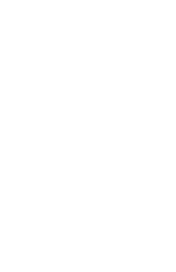

# Présentation de l'outil

_CartesMD_ est un outil **libre** et **gratuit**.
Éditez ce contenu, en respectant la syntaxe ci-dessous, pour créer vos cartes et les imprimer.

<!-- Les cartes commencent à partir du premier titre de niveau 2 : tout ce qui est écrit avant ne compte pas -->

## Cartes MD

- 

CartesMD permet de créer des cartes à jouer en Markdown !

### Un outil libre & gratuit !

On peut écrire son texte directement dans l'interface.

- Créé par [Cédric Eyssette](https://eyssette.forge.apps.education.fr/)
- Sources sur [LaForgeÉdu](https://forge.apps.education.fr/cartesmd/cartesMD.forge.apps.education.fr)
- Inspiré par [CréaCarte](https://lmdbt.forge.apps.education.fr/creacarte/) de [Cyril Iaconelli](https://lmdbt.forge.apps.education.fr/)

<!-- On sépare chaque carte par trois tirets du milieu qui se suivent  -->

---

## Modifier les cartes

- 

==Double-cliquez== sur une carte pour la modifier dans l'éditeur à gauche.

On peut utiliser ++toute++ la syntaxe _Markdown_.

### Pratique & efficace !

CartesMD calcule automatiquement la taille de police optimale pour rester dans le cadre !

---
nombreZones: 2
## Nombre de Zones

On peut changer le nombre de zones (4 par défaut et 4 au maximum) avec le paramètre `nombreZones`.

Soit on applique ce paramètre avant le titre d'une carte, soit on le définit dans l'en-tête pour qu'il s'applique à toutes les cartes

---

## Balises HTML

- 

On peut aussi utiliser du <span style="color: darkred;">HTML</span> si on veut un contrôle plus fin de l'affichage !

### Latex

Pour le $Latex$, on ajoute un en-tête _yaml_ au tout début du document, avec :

```
-​-​-
maths: true
-​-​-
```

#### :mag:

---

## Thème <br>& image de fond

- 

On peut choisir la couleur de la carte en l'indiquant dans le texte “_alt_” de l'image de fond.

### Personnalisation possible !

On peut changer l'image de fond en mettant l'URL d'une autre image.

#### 1

---

## Dos de la carte

- 

On peut écrire du contenu au dos de la carte

### Comment ?

Pour cela, il faut utiliser la balise HTML `<aside>` dans le dernier bloc d'écriture

<aside>
Tout le contenu ici apparaît au dos de la carte

On peut écrire du **Markdown** également.

Si on veut supprimer les dos de cartes, on ajoute dans l'en-tête : 

`verso: false`

</aside>

---

## 🖨️ &nbsp;Imprimer

- 

On lance simplement l'impression de cette page pour imprimer les cartes

### Paramètres d'impression

<span style="font-size:0.9em">Il faut penser à activer l'impression des arrières-plan et à désactiver les en-têtes et pieds de page.</span>

On peut utiliser `rectoVerso: true` dans l'en-tête YAML pour pouvoir imprimer en recto-verso en utilisant ensuite l'outil [pdfimpose.it](https://www.pdfimpose.it/) pour imprimer les cartes.

---

## Emojis & précisions<aside> :+1:</aside>

- 

🧪 **Les emojis :**
On les copie-colle ou bien on met le code texte :+1:

[Voir la liste des emojis disponibles](https://dataview.forge.apps.education.fr/?url=https://eyssette.forge.apps.education.fr/emojis/list.tsv)

### Autres ajouts possibles<aside> :fire:</aside>

On peut ajouter des précisions dans les titres avec “_aside_”.

On peut utiliser ou non le dernier titre, de niveau 4, pour mettre le numéro de carte, la classe, un emoji …

#### :books:

---

## Platon <aside>428-348</aside>

- 


### Philosophie antique <aside>Athènes</aside>

On peut ajouter une image dans le cadre du haut et la repositionner en CSS en utilisant le “_alt_” de l'image.

#### Term.

---

## Utiliser CodiMD

- 

<!-- On peut ne pas mettre d'image de fond -->

[CodiMD](https://codimd.apps.education.fr/) sur le portail AppsEdu permet de conserver la source de ses cartes et de les partager.

On peut alors modifier la source sans modifier le lien de partage.

### Partager ses cartes

On copie l'URL de son fichier et les cartes seront visibles à l'adresse suivante :
https://cartesmd.forge.apps.education.fr/#URLduFICHIER

D'autres éditeurs sont pris en charge :
[Hedgedoc](https://demo.hedgedoc.org/), [Digipage](https://digipage.app/). Les élèves peuvent les utiliser sans créer de comptes.

---

## Usages plus avancés

- 

On peut aussi utiliser l'en-tête _YAML_ pour ajouter des styles en CSS

### Tout peut être changé !

_card_ pour chaque carte ; _z1_ … _z4_ pour les zones d'écriture ; _back_ pour le verso et _backImage_ pour l'image de fond ; _style_ pour tout le reste. <br>Par exemple :

```
-​-​-
z1: height:300px
-​-​-
```

---

## Des exemples !

- 

Voici quelques exemples de cartes créées avec cartesMD !

### 😮

- Des cartes à utiliser en formation sur la méthode [ABC Learning Design](https://cartesmd.forge.apps.education.fr/?e=0#https://codimd.apps.education.fr/i2r_yoH8R_aLcEJhCNAYow)  
- Des cartes pour réviser les [périmètres & aires](https://cartesmd.forge.apps.education.fr/?e=0#https://codimd.apps.education.fr/l-ZZhrUlTMCHpJpm2kJ_AA) en collège (créées par Cyril Iaconelli)

<span style="font-size:0.8em">Ajoutez `?e=0` dans l'URL pour cacher l'éditeur <br>`?m=0` pour cacher le menu</span>

---

## Les thèmes

- 

Si veut faire plusieurs modifications de style pour ses cartes, cela vaut le coup d'utiliser ou de créer un thème.

### Comment faire ?

Pour utiliser un thème, il faut indiquer son nom dans le _yaml_. Par exemple :

```
theme: iaconelli.css
```

Les thèmes disponibles sont présents dans le [dossier “thème”](https://forge.apps.education.fr/cartesmd/cartesMD.forge.apps.education.fr/-/tree/main/css/theme) de CartesMD.

N'hésitez pas à m'envoyer vos propositions de thèmes !

---

## Faire des flashcards

- 

Il suffit de cliquer sur le bouton 🔄 pour activer le thème `flashcard`.

### Un modèle encore plus simple

On peut aussi utiliser le thème `flashcard-simple` pour utiliser seulement le titre 2 pour la question et la suite pour le contenu.

Voici un exemple de [flashcards en <br>Histoire-Géographie](https://cartesmd.forge.apps.education.fr/#https://codimd.apps.education.fr/eW4UTUncQ3ue56D9ThaZUg) avec ce thème (cartes créées par Françoise Vaillant).

---

## Contribuer

- 

Vous pouvez m'envoyer vos demandes d'évolution de l'outil, n'hésitez pas !

### Comment faire ?

Vous pouvez me contacter sur les [réseaux sociaux](https://eyssette.forge.apps.education.fr).

De préférence, merci <br>d'utiliser les [“tickets”](https://forge.apps.education.fr/cartesmd/cartesMD.forge.apps.education.fr/-/issues) sur LaForgeEdu (vous pouvez aussi [envoyer un mail](mailto:forge-apps+guichet+cartesmd-cartesmd-forge-apps-education-fr-1275-issue-@phm.education.gouv.fr))
